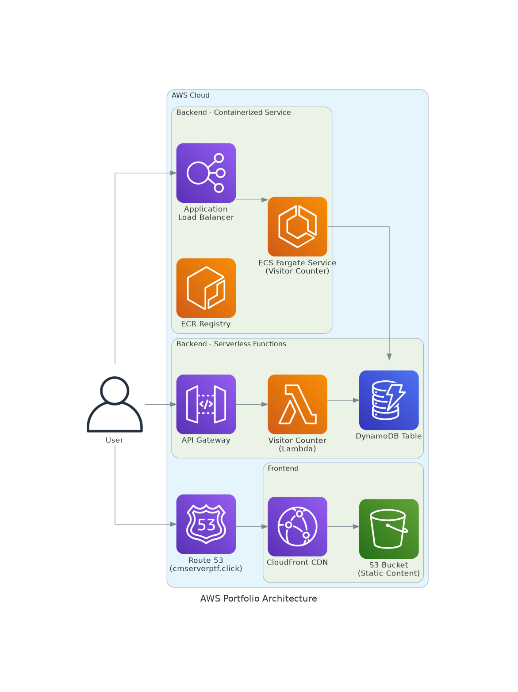

# AWS Cloud & DevOps Portfolio Project

This repository contains the infrastructure and application code for a comprehensive, production-grade portfolio website hosted on AWS. The entire system is managed via Infrastructure as Code (IaC) and deployed through a secure GitOps CI/CD pipeline.

## Live Demo

**[https://www.cmserverptf.click](https://www.cmserverptf.click)**

---

## Architecture Diagram

*(Here, we will create and embed an architecture diagram. A great, free tool for this is [diagrams.net](https://app.diagrams.net/). You can create the diagram, export it as a PNG, and add it to a `docs/` folder in your repository.)*

---

## Technology Stack

### Cloud Provider
- **AWS (Amazon Web Services)**

### Infrastructure as Code
- **Terraform:** For defining and managing all cloud resources.
- **Terraform Modules:** For a clean, reusable, and scalable IaC architecture.
- **Remote State:** Using S3 for state storage and DynamoDB for state locking.

### CI/CD & Automation
- **GitHub Actions:** For building, testing, and deploying both infrastructure and application code.
- **GitOps Workflow:** A PR-based workflow with protected branches ensures all changes are reviewed and automatically deployed upon merge to `main`.
- **OIDC Connection:** Secure, keyless authentication between GitHub Actions and AWS.
- **Conventional Commits & Semantic Versioning:** For a clean, professional Git history and release management.

### Backend
- **AWS Lambda:** Serverless compute for the visitor counter function.
- **Amazon API Gateway:** Provides a public HTTP endpoint for the Lambda function.
- **Amazon DynamoDB:** A NoSQL database for storing the visitor count.
- **Python:** The language for the Lambda function, managed with **Poetry**.

### Frontend
- **Amazon S3:** Stores the static website content (`index.html`).
- **Amazon CloudFront:** Acts as a global CDN for fast content delivery and provides a secure entry point with HTTPS.
- **Amazon Route 53:** Manages the custom domain DNS.
- **AWS Certificate Manager (ACM):** Provides the free SSL/TLS certificate.

### Code Quality & Testing
- **pre-commit:** For running automated quality checks before commits.
- **black & flake8:** For code formatting and linting.
- **pytest & moto:** For unit testing the Python application code in isolation.
- **Makefile:** Provides a simple, common interface for all development tasks (`make check`, `make test`, etc.).

### Monitoring & Observability
- **Amazon CloudWatch:**
    - A custom **Dashboard** for monitoring API and Lambda metrics.
    - **Alarms** for budget alerts and critical security events (e.g., Root user activity).
- **AWS CloudTrail:** For a complete audit trail of all account activity.
- **AWS Config:** For monitoring resource configurations and compliance.

---
## Key Features

- **Least-Privilege IAM Policies:** All IAM roles are crafted with the minimum necessary permissions, a critical security best practice.
- **Scalable CI/CD:** The application pipeline is designed to be efficient, running tests only for the code that has changed.
- **Complete Automation:** From a `git push`, the entire process of testing, infrastructure deployment, and application deployment is 100% automated.